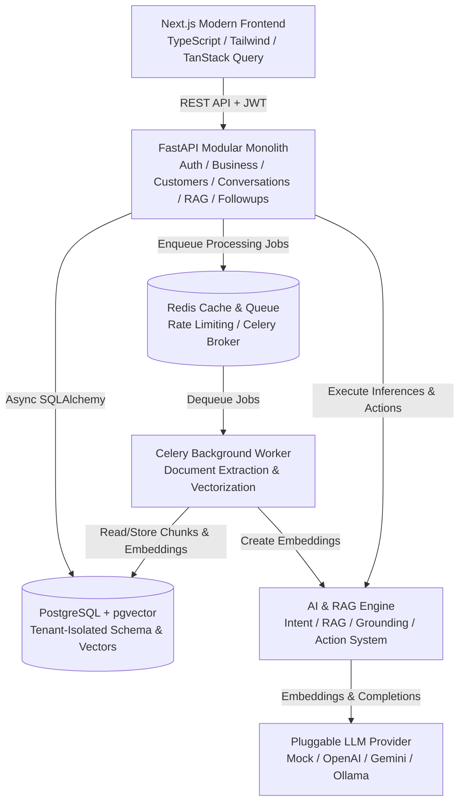
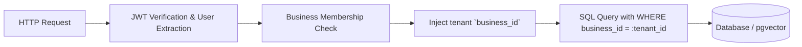
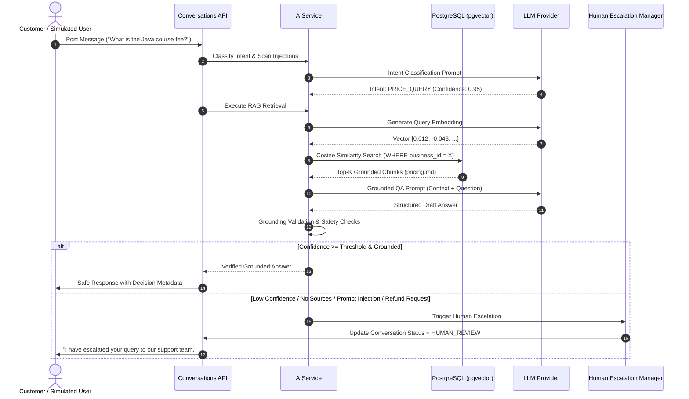
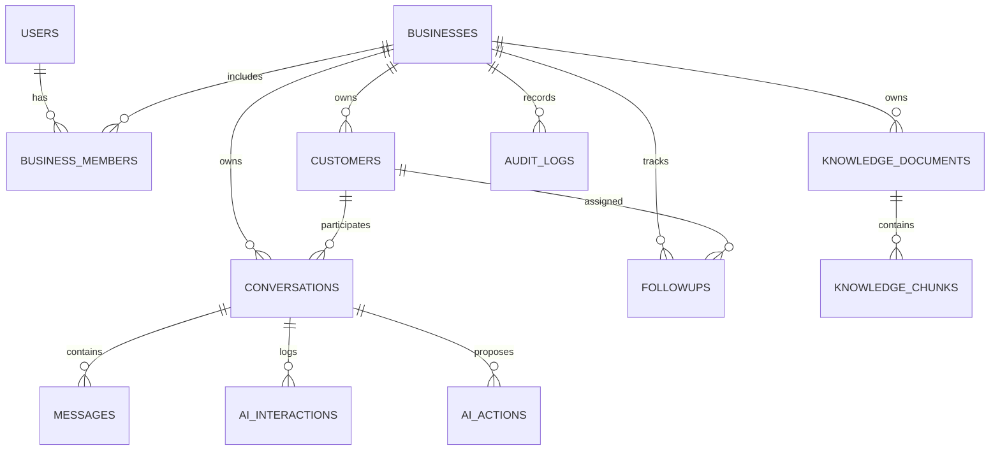

# OpsPilot System Architecture

OpsPilot is a multi-tenant, AI-powered customer operations SaaS platform designed for small businesses to manage customer conversations, centralize operational knowledge, execute grounded RAG answers, automate follow-up workflows, and maintain strict tenant isolation.

---

## 1. High-Level Component Architecture

---

## 2. Multi-Tenant Security & Isolation Model

Tenant isolation is strictly enforced at the application and query layers:

### Core Security Rules:
1. **Zero Cross-Tenant Leakage**: Every database read, write, update, vector similarity search, and audit log contains an explicit `business_id` predicate.
2. **Role-Based Access Control (RBAC)**:
   - `OWNER`: Full control over business settings, staff members, knowledge base, analytics, customer data, and conversations.
   - `STAFF`: Operational access to conversations, messaging, follow-ups, and customer records.
3. **No Direct Tool/Database Execution by LLM**:
   - The LLM only receives sanitized context and returns structured JSON responses.
   - Proposed actions (e.g., `CREATE_FOLLOWUP`, `ESCALATE_TO_HUMAN`) pass through schema validation, ownership checks, and business rules before execution.

---

## 3. RAG Pipeline & AI Safety Flow

---

## 4. Database Schema Relationships

---

## 5. Technology Stack Summary

| Layer | Technology | Rationale |
|---|---|---|
| **Frontend** | Next.js (App Router), TypeScript, Tailwind CSS, TanStack Query, Lucide Icons, Radix UI | Fast, responsive, accessible, enterprise-grade UX with dynamic state management. |
| **Backend** | Python 3.11+, FastAPI, Pydantic v2 | High-performance asynchronous API, auto-generated OpenAPI docs, strict runtime type validation. |
| **ORM / DB Access** | SQLAlchemy 2.0 (Async + Sync) + Alembic | Declarative modeling, type-safe queries, reliable schema migrations. |
| **Database** | PostgreSQL 16 + pgvector | ACID relational integrity + native high-dimensional vector similarity search in a single engine. |
| **Task Queue & Cache** | Redis 7 + Celery | Scalable asynchronous document chunking, embedding generation, and rate limiting. |
| **AI / RAG** | Provider-agnostic abstraction (Mock, OpenAI, Gemini, Ollama) | Zero vendor lock-in, fully testable offline with deterministic mock provider or live LLMs. |
| **Containerization** | Docker, Docker Compose | Reproducible local and staging deployment with 1-command startup. |
